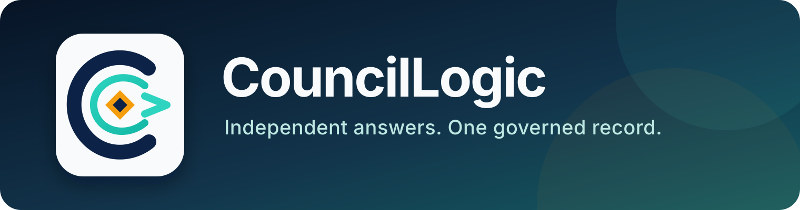

# CouncilLogic

<p align="center">
  
</p>

<p align="center">
  <a href="https://github.com/apcar/CouncilLogic/actions/workflows/ci.yml"></a>
  
  
  
</p>

**Send one question across models, blind their judgments, and keep the complete
record.**

CouncilLogic is a local-first, auditable orchestration and governance layer for
heterogeneous language-model deliberation. It sends a question to configured
providers independently, blinds and aggregates their judgments, synthesizes the
result, and stores the complete run record locally. It currently ships with
live adapters for OpenAI, Anthropic, Gemini, Mistral, xAI's Grok, Alibaba's
Qwen, and Cohere Command. An Upstage Solar adapter is available as an optional,
disabled bench provider.

This repository is a **public alpha (`0.2.0a1`)**, not a production service or
a truth oracle. Multiple models can share the same error. Verify consequential
claims against primary sources.

## What is—and is not—new

The council algorithm is not claimed as novel. Multi-model ensembles, model
juries, debate, voting, blinded labels, and synthesis predate this project; the
workflow is a governed descendant of the council pattern popularized by
[Karpathy's `llm-council`](https://github.com/karpathy/llm-council).

The contribution is the control plane around that pattern: attributable
principal identity, action-scoped mandates, owner-scoped access, bounded
logical-invocation budgets, durable audit records, restart recovery,
idempotency, token rotation and revocation, single-writer fencing, and explicit
operator authority.

### Why I built it

This began with a practical limitation in my own work. Giving one model several
roles could broaden a response, but it did not create genuinely independent
judgment: each role still inherited the same model lineage, training influences,
policies, and blind spots. I wanted distinct providers to answer independently,
evaluate blinded alternatives, preserve disagreement, and leave an inspectable
record.

That is a single-operator origin, not a validation result. Published research
makes heterogeneous model juries and aggregation worth testing, but also
documents correlated errors and inconsistent gains. The current test suite
establishes software behavior; it does not show that fifteen calls outperform a
strong single model. Establishing that would require matched-cost baselines,
protocol ablations, and evaluation across additional users and task domains.
See [Research](docs/RESEARCH.md).

## How CouncilLogic works

1. **Propose:** every configured lineage emits an independently reasoned,
   size-bounded JSON artifact.
2. **Judge:** each participating lineage ranks relabeled candidates without
   provider attribution; structured responses are validated locally.
3. **Aggregate:** deterministic Borda scoring combines valid juries.
4. **Synthesize:** the selected lineage receives bounded candidates, the
   aggregate, and compact vote records and writes the final answer.

A default live run uses fifteen application-level calls: seven proposals,
seven juries, and one synthesis. Mock mode and the frozen `0.2.0a1` service
reference topology remain four-lineage, nine-call fixtures. Successful work is
persisted and reused on resume. The application does not give models tools,
web access, code execution, or model-initiated actions.

## Workload reliability

Before the first provider call, CouncilLogic deterministically projects the
largest prompt each stage can produce from the configured participant count
and protocol bounds. It rejects a question when either the input itself or the
projected downstream prompt graph exceeds policy, so an oversized run fails
before incurring provider cost.

Providers have separate proposal, jury, and synthesis output-token and request
timeout budgets. At most five provider calls run simultaneously by default,
and Qwen receives longer bounded stage timeouts for long council prompts. Known
`finish_reason=length` completions may receive one
larger-output retry when the run still has call, deadline, and recovery budget.
The truncated response is first preserved as an audit event. Ambiguous
timeouts, connection losses, and interrupted running calls are never retried
automatically.

Every terminal result reports `completion_quality` as `clean` or `degraded`,
membership counts, recovery records, projected and actual prompt sizes, and
application-level call count. A completed synthesis can therefore be
distinguished from a clean council run; partial and failed runs are always
degraded.

## Five-minute credential-free quickstart

Requires Python 3.11 or newer. Mock mode is deterministic, makes no provider
requests, and needs no credentials.

```bash
git clone https://github.com/apcar/CouncilLogic.git
cd CouncilLogic
python3 -m venv .venv
. .venv/bin/activate
python -m pip install -e .

council --mock --data-dir ./work/demo doctor
council --mock --data-dir ./work/demo run \
  --question "What should I verify before relying on this council?" \
  --json
council --mock --data-dir ./work/demo list
```

Use the returned `run_id` to inspect or export the durable record:

```bash
council --mock --data-dir ./work/demo inspect RUN_ID --json
council --mock --data-dir ./work/demo export RUN_ID \
  --format markdown --output ./work/demo-run.md
```

## Live CLI setup

The default live CLI sends the question and candidate text to all seven
configured providers. Review provider contracts, data handling, model
availability, and cost controls before using sensitive material.

```bash
export OPENAI_API_KEY="..."
export ANTHROPIC_API_KEY="..."
export GEMINI_API_KEY="..."
export MISTRAL_API_KEY="..."
export XAI_API_KEY="..."
export DASHSCOPE_API_KEY="..."
export COHERE_API_KEY="..."

council doctor
council providers
council run --question "Your decision question"
```

The default Qwen destination is Alibaba Model Studio's
Singapore/International endpoint. `DASHSCOPE_API_KEY` must be issued for that
region; Alibaba regional keys are not interchangeable.

Upstage is registered but disabled in `council.example.toml`. Enabling it adds
an eighth participant, requires `UPSTAGE_API_KEY`, and should follow a direct
live proposal/jury canary because its structured-output compatibility has not
yet been verified in this project.

Avoid putting credentials in shell history. For durable use, configure
`MODEL_COUNCIL_SECRET_COMMAND` with an absolute executable path. The executable
receives one logical secret name, must print only its value, and must fail
closed. `.env` loading is deliberately unsupported. See
[Operations](docs/OPERATIONS.md) and [Security](docs/SECURITY.md).

Default models and endpoints are recorded in
[`council.example.toml`](council.example.toml). Provider access and pricing
change over time; verify them with the official provider documentation before
a live run.

## Service warning

> [!WARNING]
> The `0.2.0a1` HTTP service is **mock-only and loopback-only**. It cannot
> construct live-provider adapters. Do not bind it to a non-loopback address,
> place it behind a tunnel or remote front door, enable either work principal,
> or use it for production or commercial traffic.

The fixed six-principal catalog is a public reference deployment for testing
governance boundaries. It is not a claim that those principal names or that
topology fit another operator. The two work principals are forced disabled.
See [Portable service](docs/PORTABLE-SERVICE.md).

## Data and security

Runs are stored in a plaintext SQLite database. Questions, prompts, model
responses, jury records, errors, and provider metadata may all be retained.
Credentials are not intentionally persisted or printed, but secrets included
in input or model output become audit content. The default directory is
`~/.local/share/model-council/`; use `--data-dir` to choose another location.

Read the [security model](docs/SECURITY.md) before using non-public data.
Privately report vulnerabilities using GitHub's private vulnerability
reporting for this repository.

## Documentation

- [Operations runbook](docs/OPERATIONS.md)
- [Security model and vulnerability reporting](docs/SECURITY.md)
- [Portable mock service and fixed reference topology](docs/PORTABLE-SERVICE.md)
- [Research grounding and claim boundaries](docs/RESEARCH.md)
- [Licensing strategy](LICENSING.md)
- [Architecture decisions](docs/adr/)
- [Support](SUPPORT.md)
- [Changelog](CHANGELOG.md)

## Research grounding

The design draws on published work about multi-agent debate, voting,
heterogeneous model juries, position bias, and adversarial persuasion. This
grounding motivates diversity, blinded ordering, deterministic aggregation,
and conservative claim boundaries; it does not establish that a council is
correct or independent evidence. See [Research](docs/RESEARCH.md) for sources
and design implications.

## Contributing

Bug reports and design proposals are welcome through the repository's issue
forms. External pull requests and other copyrightable contributions are closed
until a counsel-reviewed contributor license agreement is available. Please
read [CONTRIBUTING.md](CONTRIBUTING.md) and the
[Code of Conduct](CODE_OF_CONDUCT.md) before participating.

## License

The code is licensed under the
[GNU Affero General Public License v3 only](LICENSE), SPDX
`AGPL-3.0-only`. In brief, the AGPL permits use, study, modification,
distribution, self-hosting, and commercial use subject to its terms. Modified
versions offered for remote network interaction must offer Corresponding
Source to those users as required by section 13. This summary is not legal
advice; the license text controls. Trademark treatment for the CouncilLogic
name and mark is separate from the code license.
